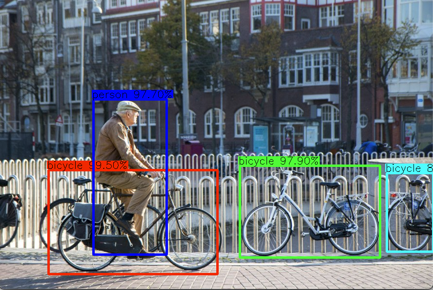

# Object Detection with YOLOv4

    

## This project uses the [tf2-yolov4](https://github.com/sicara/tf2-yolov4) implementation to load the [COCO](https://cocodataset.org/#home) pretrained weights for YOLOv4 into a TF neural network.

### These are the main functionalities on this repository:
### 1.- Implementation of object detection on a real time video stream from a local webcam. (Via a jupyter notebook)
### 2.- Implementation of an API webservice able to serve the object detection algorithm using a dockerized environment.

